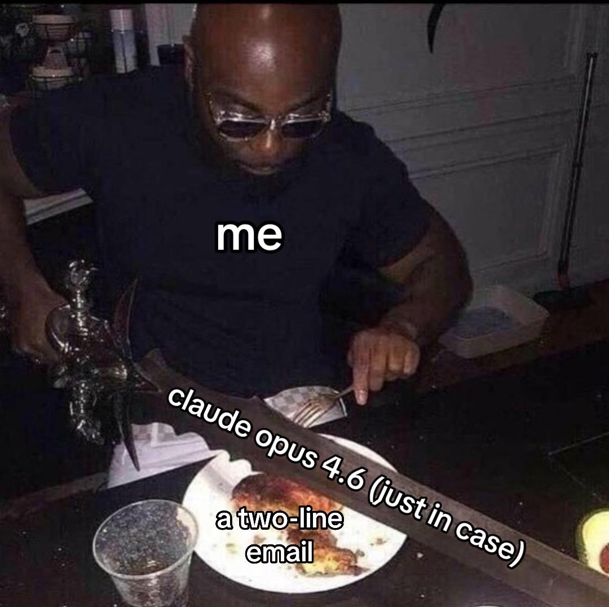

## The First Taste
I still remember the first moment I saw GitHub's Copilot autocomplete merge sort. It was a magical moment. I was excited, scared, and amazed at the same time. "Think of all the possibilities!" I thought. We could generate tests, we could generate functions just by adding comments at the top to describe what we want, and we could generate documentation. Pretty cool!

## Ramping Up
Then came [Sonnet 3.5](https://www.anthropic.com/news/claude-3-5-sonnet) and [Gemini 2.5 Pro](https://blog.google/innovation-and-ai/models-and-research/google-deepmind/gemini-model-thinking-updates-march-2025/). These two opened the door to generating entire web applications! It wasn't just docs and tests, now we could prompt a fully-functioning app into existence and the race was on. This was when I got super into coding agents. By this time I was still writing some manual code and things weren't too bad.

Fast forward to today, our models are vastly more powerful. We can one-shot complex refactors that would have taken us days. We can add complicated features with a single prompt. And we can do all of that from our phone with [remote-control](https://code.claude.com/docs/en/remote-control). At this point, I'm fully hooked!

## Gambling With Extra Steps
Each time you sit down to implement a feature you don't know what you will get. You either hit the jackpot and one-shot the problem or you'll find yourself wrestling with the AI gods for hours to get the code to where you want it to be.

Just as you start getting used to the capabilities of each model, a new one comes along and raises the ceiling. Increasing the dose just enough to break above the tolerance threshold we've built.

Add to the mix that you need to pay a subscription fee to be able to get into the coding casino and you have got yourself a pretty standard gambling situation.

## Addiction
I now have a strong urge to use my coding agent for everything. Even if it's an extremely trivial change, I open Claude Code (which now conveniently has its own alias: `c`!) and describe the change I want to make. This oftentimes takes more time than a manual change, but I crave that sweet dopamine hit of a successful prompt! The euphoric feeling of hitting the jackpot!

This is effectively a slot machine but for software engineers. We got addicted to Claude Code just like kids got addicted to loot boxes and Labubus.

## One More Feature
At some point I felt like I could build anything and everything. I had 4 concurrent agents running working on different features, bug fixes, refactors, and performance improvements. Doing anything else felt like a waste of time. Churning out code was extremely easy after all. Unfortunately, this process resulted in a lot of poorly-vetted, sub-par code that has turned into technical debt.

## Frustration
As the days go by, the high of successful prompts is being eroded away by the frustration of getting the AI to produce good, usable code. Getting these tools to generate code the way you want them to is my biggest problem today. I have tried skills, `CLAUDE.md`, `AGENTS.md`, and every other trick in the book but at the end of the day, the code just isn't good enough. It might be correct, but it is not robust. At least the first draft isn't. But that's a topic for another time.

## Rehab
Admittedly, coding agents aren't *really* slot machines. You would need negative expected returns for them to be. AI is an amazing technology that has already revolutionized how I work and I will continue using it every day. Albeit with some modifications.

These days I find myself spending less time on features that are not important. The allure of building has never been stronger and thus it is more important than ever to be defensive about what actually deserves being built. The response to "Should we make this?" needs to be a resounding HELL YEAH or a firm no. If in doubt, skip it.

As for code quality, it is easy to forget that the code your agent generates is your code and not someone else's. Remember that and make sure the code you merge is as good as the code you would have manually crafted before the age of AI.
